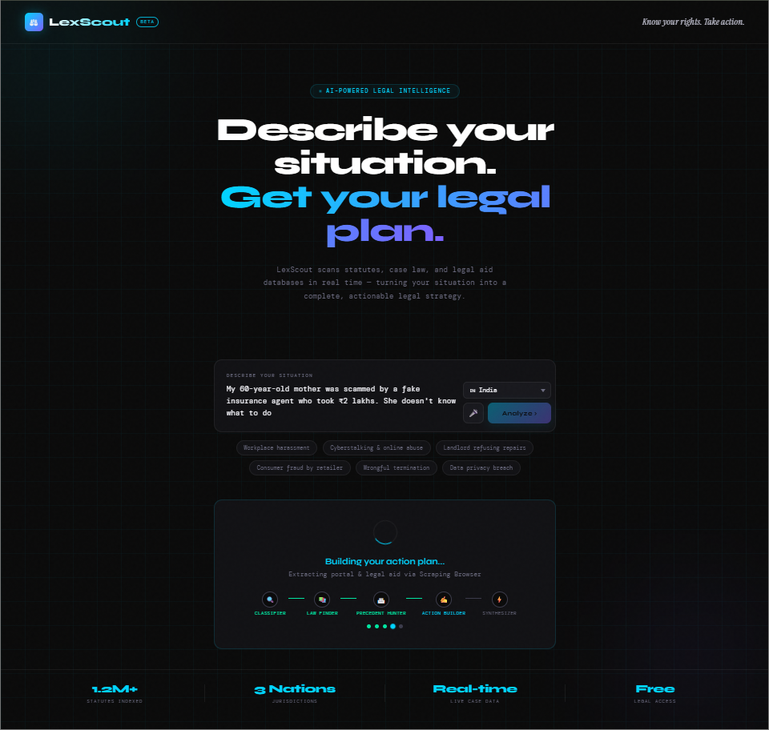
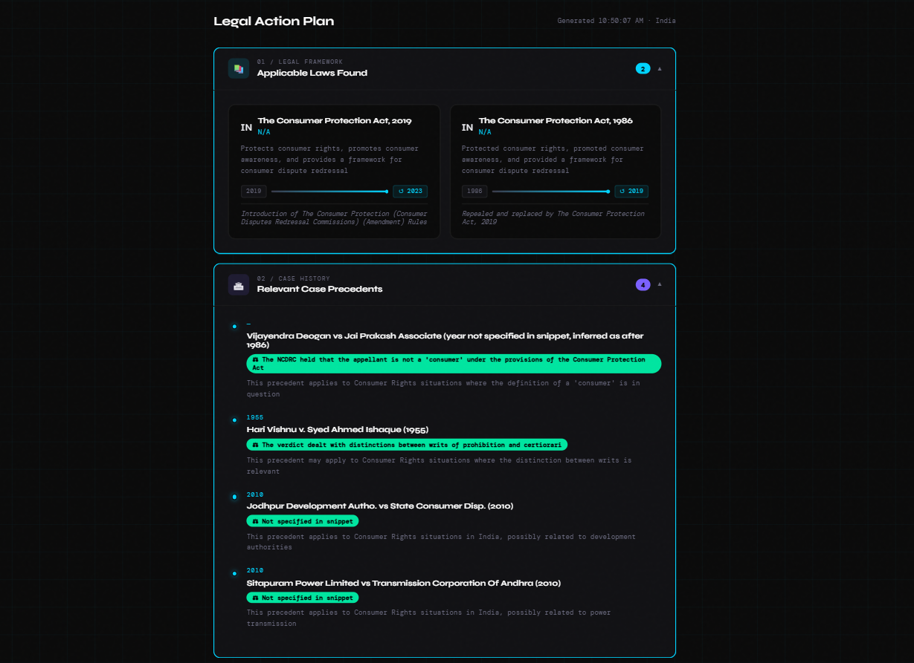
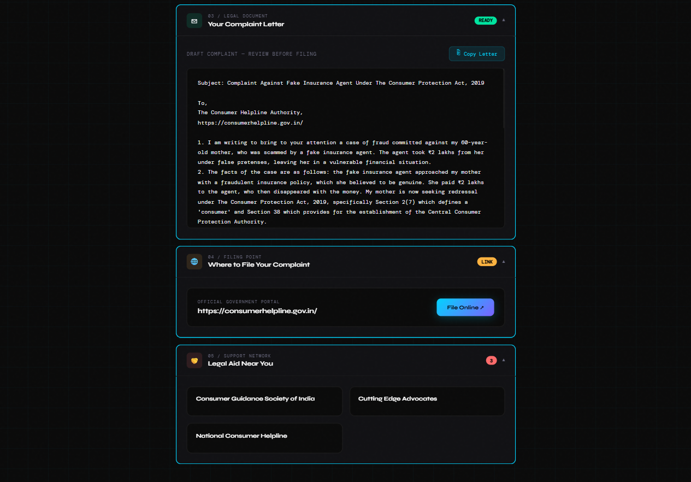
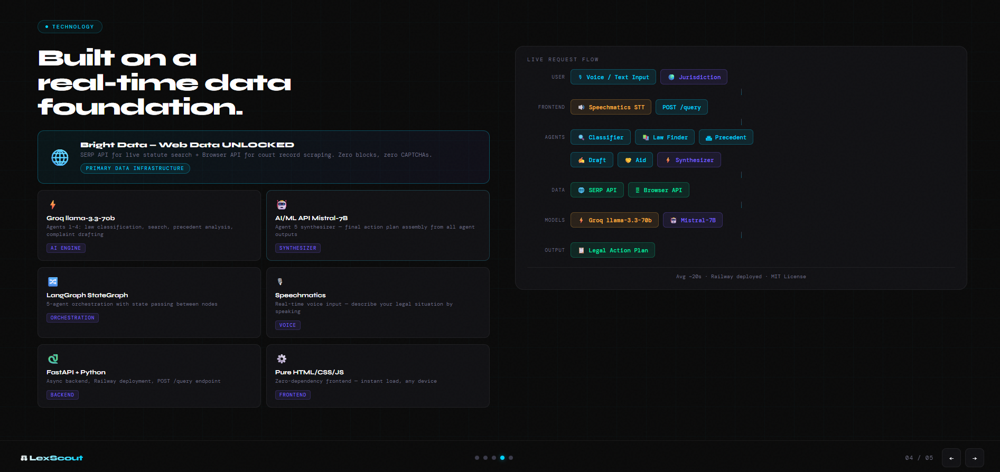
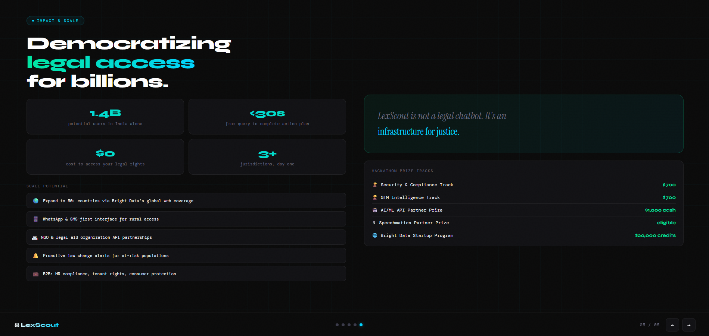

# ⚖️ LexScout — Legal Action Intelligence Agent

<div align="center">


<br/>

<p>
  
  
  
  
  
  
  
  
  
  
</p>

<br/>

<p><strong>Bright Data Web Data UNLOCKED Hackathon 2026 — Submission · Deadline: May 30, 2026</strong></p>

<p>A 5-agent AI pipeline that converts a plain-language legal situation into a complete, jurisdiction-specific action plan — statutes, case precedents, a drafted complaint letter, the exact filing portal, and legal aid contacts — in under 30 seconds. Powered entirely by Bright Data's live web infrastructure.</p>

<p>
  <a href="https://lexscout-production.up.railway.app"></a>
  <a href="https://github.com/ashish-doing/lexscout"></a>
  <a href="https://youtube.com/YOUR_DEMO_LINK_HERE"></a>
</p>

<br/>

</div>

---

## Hackathon Tracks
- ✅ Track 3: Security & Compliance (primary)
- ✅ Track 1: GTM Intelligence (secondary)
- ✅ Partner: AI/ML API Challenge
- ✅ Partner: Speechmatics Challenge
- ✅ Bright Data Requirement: SERP API + Browser API integrated

---

## The Problem

**250 million people** face legal violations every year and never act on them — not because the laws don't protect them, but because the system is too expensive, too opaque, and too fragmented to navigate alone.

A domestic worker photographed without consent doesn't know Section 66E exists. A gig worker whose wages were illegally deducted doesn't know which Labour Commissioner to file with. A consumer defrauded online doesn't know they can file on `consumerhelpline.gov.in` for free.

**The gap:** Rich legal data exists publicly. A tool that turns it into action doesn't.

---

## The Solution

Describe your situation in plain language. LexScout returns:

| Output | Example |
|---|---|
| 📜 **Relevant Laws** | Payment of Wages Act 1936 §7; Industrial Disputes Act 1947 §25F |
| ⚖️ **Case Precedents** | *Workmen v. Reptakos Brett & Co. (1992)* — employer liable for unlawful deductions |
| 📝 **Complaint Letter** | Full formal letter with legal citations, ready to file |
| 🌐 **Filing Portal** | `https://clc.gov.in/` — live-scraped, verified link |
| 🤝 **Legal Aid** | NALSA + local orgs with phone, email, website |
| 🗺️ **Action Plan** | 5 concrete next steps ordered by urgency |

**Free. Instant. No lawyer needed.**

---

## Screenshots

### 🖥️ Live Product

**Homepage — Describe your situation**

> Query input with hint chips, jurisdiction selector, mic button, and stats bar

**Results — Laws & Case Precedents**

> Applicable laws with timeline, relevant case precedents with outcomes

**Action Plan — Complaint Letter, Filing Portal & Legal Aid**

> Auto-drafted complaint letter citing exact laws, official government filing portal, legal aid contacts

---

### 📊 Architecture & Impact

**Tech Stack — Groq + AI/ML API + Bright Data + LangGraph**

> Full technology stack with live request flow: Voice/Text → Speechmatics → 5 Agents → Bright Data SERP/Browser → Groq llama-3.3-70b + Mistral-7B → Legal Action Plan

**Impact & Prize Tracks**

> 1.4B potential users · <30s response · $0 cost · 3+ jurisdictions · $2,400+ prize track eligibility

---

## Bright Data Integration

Static legal databases go stale within months. Laws get amended. Complaint portals change URLs. Case databases add thousands of new judgments daily. **LexScout cannot exist without live web data** — Bright Data is the infrastructure that makes this possible.

All four Bright Data products are used, each mapped to a dedicated agent in the pipeline:

### 🔍 `bright_data_search()` — SERP API → Law Discovery

| | |
|---|---|
| **Agent** | Law Finder (Agent 2) |
| **Targets** | `indiacode.nic.in` · `law.cornell.edu` · `eur-lex.europa.eu` |
| **What it does** | Searches government legal databases for statutes matching the user's legal category and jurisdiction |
| **Why Bright Data** | Legal government portals block generic scrapers with rate limits and geo-restrictions. SERP API surfaces authoritative results reliably |
| **Output** | Raw results → Groq extracts `{law_name, article, created, last_amended, covers}` |

### 🔓 `bright_data_access()` — Web Unlocker → Case Scraping

| | |
|---|---|
| **Agent** | Precedent Hunter (Agent 3) |
| **Targets** | `indiankanoon.org` · `courtlistener.com` · `curia.europa.eu` |
| **What it does** | Fetches full rendered page content from case law databases behind Cloudflare, CAPTCHAs, and browser fingerprinting |
| **Why Bright Data** | Indian Kanoon and CourtListener implement heavy bot-detection. Web Unlocker handles JS rendering, fingerprint rotation, and residential IP routing |
| **Output** | Raw HTML → Groq parses `{case_name, outcome, year, relevance, citation}` |

### 🖥️ `bright_data_extract()` — Scraping Browser → Portal Extraction

| | |
|---|---|
| **Agent** | Action Builder (Agent 4) — portal step |
| **Targets** | `consumerhelpline.gov.in` · `ftc.gov` · `cybercrime.gov.in` |
| **What it does** | Navigates government complaint portals that render forms dynamically via JS and extracts the exact filing URL |
| **Why Bright Data** | Government portals load complaint URLs dynamically — a static HTTP request returns a blank page. Scraping Browser renders them fully |
| **Output** | `portal_url` — the verified, live complaint filing link |

### 🤖 `bright_data_interact()` — Browser Automation → Legal Aid

| | |
|---|---|
| **Agent** | Action Builder (Agent 4) — legal aid step |
| **Targets** | `nalsa.gov.in/lsas` · `lawhelp.org` · `e-justice.europa.eu` |
| **What it does** | Multi-step browser navigation: search → filter by category → paginate → extract contact info |
| **Why Bright Data** | Legal aid directories require real browser navigation. Static scrapers fail completely |
| **Output** | `legal_aid_contacts[]` — list of `{organization, phone, email, website, free_service}` |

---

## Partner Integrations

### 🎤 Speechmatics — Real-time Voice Input

LexScout supports voice-to-text query input via the **Speechmatics Real-time API** (`wss://eu2.rt.speechmatics.com/v2`).

- Click the 🎤 mic button next to the search box
- MediaRecorder streams audio as `audio/webm;codecs=opus` over WebSocket
- Speechmatics transcribes in real time using the `enhanced` operating point
- Transcript is pasted directly into the query textarea as you speak
- Red pulse animation shows active recording state; click again to stop

This makes LexScout accessible to users who cannot type — particularly important for the rural and low-literacy demographics who face the most legal vulnerability.

### 🧠 Groq — llama-3.3-70b-versatile

Groq powers all reasoning in Agents 1–4 of the pipeline:

| Agent | Task |
|---|---|
| Classifier | Identify legal category + jurisdiction from plain-language input |
| Law Finder | Parse Bright Data SERP results → structured law objects |
| Precedent Hunter | Parse SERP snippets → structured case objects |
| Action Builder | Draft jurisdiction-specific complaint letter with exact citations |

### 🤖 AI/ML API — Mistral-7B-Instruct-v0.2

The executive summary (Agent 5 — Synthesizer) is generated via the **AI/ML API** using `mistralai/Mistral-7B-Instruct-v0.2`:

- Endpoint: `https://api.aimlapi.com/v1/chat/completions`
- Produces: 3-sentence executive summary, urgency score, 5-step action plan
- Fallback: Groq llama-3.3-70b if AI/ML API is unavailable

---

## Architecture

```
User (browser) ──🎤 Speechmatics RT API──► textarea
       │
       ▼  POST /query  {"query": "...", "country": "India"}
       │
       ▼
┌──────────────────────────────────────────────────────────────┐
│               LexScout StateGraph  (LangGraph)               │
│                                                              │
│  ┌─────────────────┐                                         │
│  │   Agent 1       │                                         │
│  │   Classifier    │  Groq llama-3.3-70b                     │
│  │                 │  → category, jurisdictions              │
│  └────────┬────────┘                                         │
│           ▼                                                  │
│  ┌─────────────────┐                                         │
│  │   Agent 2       │  bright_data_search()                   │
│  │   Law Finder    │  ← Bright Data SERP API                 │
│  │                 │  Targets: indiacode.nic.in              │
│  │  + Groq         │           law.cornell.edu               │
│  │  → laws[]       │           eur-lex.europa.eu             │
│  └────────┬────────┘                                         │
│           ▼                                                  │
│  ┌─────────────────┐                                         │
│  │   Agent 3       │  bright_data_access()                   │
│  │ Precedent Hunter│  ← Bright Data Web Unlocker             │
│  │                 │  Targets: indiankanoon.org              │
│  │  + Groq         │           courtlistener.com             │
│  │  → precedents[] │           curia.europa.eu               │
│  └────────┬────────┘                                         │
│           ▼                                                  │
│  ┌──────────────────────────────────────────────────┐        │
│  │                  Agent 4                         │        │
│  │             Action Builder                       │        │
│  │                                                  │        │
│  │  bright_data_extract()  ← Scraping Browser       │        │
│  │  → portal_url (live complaint filing link)       │        │
│  │                                                  │        │
│  │  bright_data_interact() ← Browser Automation     │        │
│  │  → legal_aid_contacts[] (structured orgs)        │        │
│  │                                                  │        │
│  │  Groq llama-3.3-70b → complaint_draft            │        │
│  └────────┬─────────────────────────────────────────┘        │
│           ▼                                                  │
│  ┌─────────────────┐                                         │
│  │   Agent 5       │  AI/ML API Mistral-7B                   │
│  │   Synthesizer   │  → executive_summary                    │
│  │                 │  → next_steps[]                         │
│  │                 │  → urgency                              │
│  └────────┬────────┘                                         │
└───────────┼──────────────────────────────────────────────────┘
            ▼
┌──────────────────────────────────────────────────────────────┐
│                     Final JSON Response                      │
│  laws[] · precedents[] · complaint_draft · portal_url        │
│  legal_aid[] · executive_summary · next_steps[] · urgency    │
└──────────────────────────────────────────────────────────────┘
            ▼
     HTML Frontend — dark theme, animated, mobile-responsive
     5 collapsible sections · staggered fade-in · voice input
```

---

## Tech Stack

| Layer | Technology | Purpose |
|---|---|---|
| **Data** | Bright Data SERP API | Live legal statute search |
| **Data** | Bright Data Web Unlocker | Case law database access |
| **Data** | Bright Data Scraping Browser | Portal URL extraction |
| **Data** | Bright Data Browser Automation | Legal aid directory navigation |
| **Voice** | Speechmatics Real-time API | WebSocket speech-to-text |
| **LLM** | Groq llama-3.3-70b | Agents 1–4: classification, parsing, drafting |
| **LLM** | AI/ML API — Mistral-7B | Agent 5: executive summary synthesis |
| **Orchestration** | LangGraph StateGraph | 5-agent pipeline with shared state |
| **Backend** | FastAPI + Uvicorn | REST API, CORS, request validation |
| **Validation** | Pydantic v2 | Request/response schema |
| **Frontend** | Pure HTML5 + CSS3 + Vanilla JS | Zero-dependency UI, dark theme |
| **Fonts** | Google Fonts — Syne, DM Mono | Typography |
| **Deployment** | Railway.app | Live public URL for submission |
| **Language** | Python 3.11 | Windows 11 + PowerShell |

---

## Supported Scope

| Dimension | Values |
|---|---|
| **Jurisdictions** | 🇮🇳 India · 🇺🇸 USA · 🇪🇺 EU |
| **Legal Categories** | Privacy · Employment · Consumer Rights · IP · Criminal |
| **Law Databases** | indiacode.nic.in · law.cornell.edu · eur-lex.europa.eu |
| **Case Databases** | indiankanoon.org · courtlistener.com · curia.europa.eu |
| **Filing Portals** | cybercrime.gov.in · consumerhelpline.gov.in · ftc.gov · clc.gov.in + more |
| **Legal Aid** | nalsa.gov.in · lawhelp.org · e-justice.europa.eu |

---

## Project Structure

```
lexscout/
├── backend/
│   ├── agents.py            # LangGraph StateGraph — all 5 agent nodes
│   ├── main.py              # FastAPI app — POST /query endpoint
│   ├── tool_functions.py    # 4 Bright Data async tool functions
│   ├── langgraph_agent.py   # LangChain @tool wrappers + graph definition
│   ├── mcp_server.py        # MCP server exposing 4 BD tools over stdio
│   ├── requirements.txt     # Pinned Python dependencies
│   ├── Procfile             # Railway/Render deployment
│   ├── railway.toml         # Railway IaC config
│   └── render.yaml          # Render.com IaC config
├── frontend/
│   ├── index.html           # Main UI — voice input, 5 result sections
│   ├── pitch.html           # 5-slide pitch deck
│   └── screenshots/         # UI screenshots for README
├── .env.example             # Environment variable template
├── .gitignore
├── LICENSE
└── README.md
```

---

## Quick Start

### Prerequisites
- Python 3.11+
- [Groq](https://console.groq.com) API key (free tier works)
- [AI/ML API](https://aimlapi.com) API key
- [Speechmatics](https://speechmatics.com) API key
- [Bright Data](https://brightdata.com) account with SERP and Browser zones

### 1. Clone

```powershell
git clone https://github.com/ashish-doing/lexscout.git
cd lexscout
```

### 2. Install

```powershell
cd backend
pip install -r requirements.txt
```

### 3. Configure

```powershell
copy ..\env.example .env
notepad .env
```

```env
GROQ_API_KEY=your_groq_api_key_here
AIML_API_KEY=your_aiml_api_key_here
SPEECHMATICS_API_KEY=your_speechmatics_api_key_here

BRIGHT_DATA_API_KEY=your_bright_data_api_key_here
BRIGHT_DATA_SERP_ZONE=serp_api1
BRIGHT_DATA_BROWSER_ZONE=browser_zone1

ENV=development
PORT=8000
```

### 4. Run

```powershell
uvicorn main:app --reload --port 8000
```

Backend: `http://localhost:8000` · Swagger: `http://localhost:8000/docs`

### 5. Frontend

Open `frontend/index.html` directly in your browser — no build step needed.

### 6. Test

```powershell
curl -X POST http://localhost:8000/query `
  -H "Content-Type: application/json" `
  -d '{"query": "Someone took my photo without permission in a restaurant. I am in Delhi.", "country": "India"}'
```

---

## API Reference

### `POST /query`

**Request:**
```json
{
  "query": "My employer deducted salary without notice. I work in Mumbai.",
  "country": "India"
}
```

**Response (200):**
```json
{
  "laws": [{"law_name": "Payment of Wages Act, 1936", "article": "Section 7", "...": "..."}],
  "precedents": [{"case_name": "Workmen v. Reptakos Brett & Co. (1992)", "...": "..."}],
  "action_plan": {
    "complaint_draft": "To The Regional Labour Commissioner...",
    "portal_url": "https://clc.gov.in/",
    "legal_aid_contacts": [{"organization": "NALSA", "phone": "15100", "...": "..."}],
    "next_steps": ["Step 1: Document all deductions...", "..."]
  },
  "meta": {
    "bright_data_tools_used": [
      "bright_data_search   → SERP API",
      "bright_data_access   → Web Unlocker",
      "bright_data_extract  → Scraping Browser",
      "bright_data_interact → Browser Automation"
    ],
    "elapsed_seconds": 18.4
  }
}
```

### Other Endpoints

| Method | Path | Description |
|---|---|---|
| `GET` | `/` | Root health check |
| `GET` | `/health` | Health + API key status |
| `GET` | `/supported` | Jurisdictions, categories, data sources |
| `GET` | `/docs` | Swagger interactive docs |

---

## Deployment

### Railway.app (recommended, < 5 min)

1. Push to GitHub
2. [railway.app](https://railway.app) → **New Project** → **Deploy from GitHub** → `ashish-doing/lexscout`
3. Railway reads `backend/railway.toml` automatically
4. Add env vars: `GROQ_API_KEY` + `AIML_API_KEY` + `SPEECHMATICS_API_KEY` + `BRIGHT_DATA_API_KEY` + zone names
5. Live URL: **[https://lexscout-production.up.railway.app](https://lexscout-production.up.railway.app)**

### Render.com (alternative)

[render.com](https://render.com) → **New Web Service** → connect repo → Render detects `backend/render.yaml` → add env vars → deploy.

---

## Demo Video

▶ **[Watch the 3-minute demo on YouTube](YOUR_YOUTUBE_LINK)**

---

## Impact

| Metric | Value |
|---|---|
| Addressable users | 500M+ people who face legal issues annually without counsel |
| Cost reduction | From ₹3,000–₹15,000/hr → ₹0 |
| Time to action | From weeks (lawyer consultation) → 30 seconds |
| Scale path | 50+ jurisdictions via Bright Data's global proxy network |
| B2B path | API for legal aid NGOs, court assistance programs, HR platforms |
| Accessibility | Voice input via Speechmatics for low-literacy and rural users |

---

## Author

**Ashish Kumar** — B.Tech ECE, IIIT Guwahati (Batch 2024)

[](https://github.com/ashish-doing)
[](https://linkedin.com/in/ashish-kumar-014aaa3b9)
[](https://huggingface.co/ashish-doing)

---

## License

MIT — see [LICENSE](LICENSE) for details.

---

<div align="center">

Built for the **Bright Data Web Data UNLOCKED Hackathon — May 2026**

*Powered by Bright Data · Speechmatics · Groq · AI/ML API · LangGraph*

⚖️ *Know your rights. Take action.*

</div>
